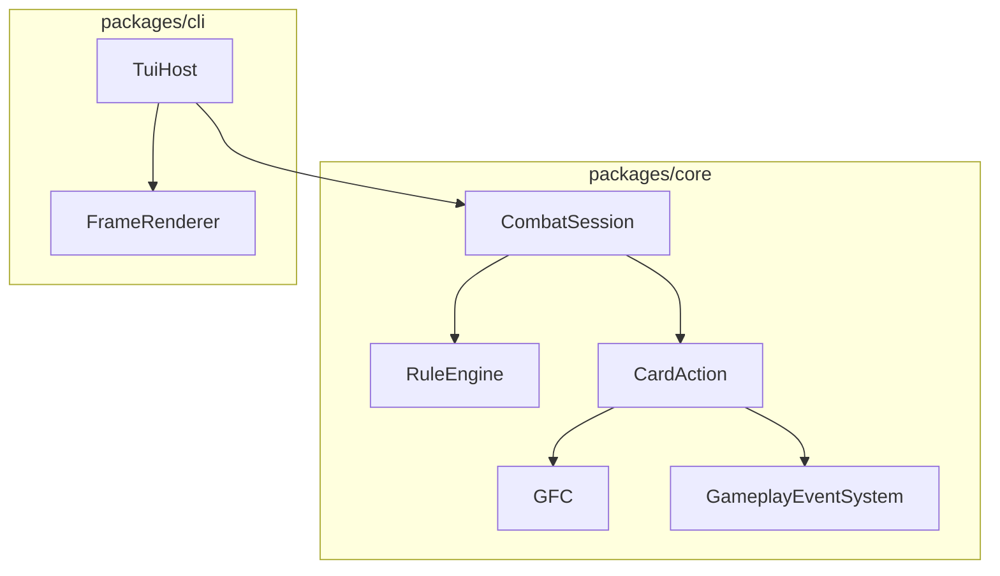
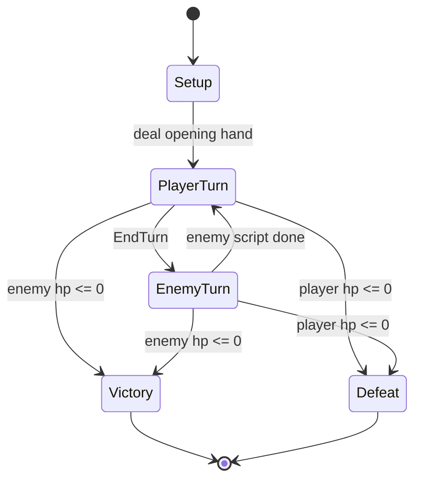

# COMBAT-F01 — Minimal battle-only rules slice

Status: Done  
Feature ID: COMBAT-F01  
Updated: 2026-07-13

Gameplay reference (read-only): [combat.md](../../design/systems/combat.md), [gameplay-framework.md](../../design/systems/gameplay-framework.md)

---

## Goal

Deliver the first **closed-loop battle rules machine** on top of existing GFC infrastructure.

Prove that one combat encounter can run end-to-end in `packages/core` and be played through the terminal host (`CLI-F02`), without committing to full card/GA/equipment game design yet.

This is a **GFC validation slice**, not the final combat system.

---

## Scope

### In scope

1. **CombatSession** state machine in `@cardgame/core`
   - Phases: setup → player turn → enemy turn → victory/defeat
2. **Deck / hand / discard** for the player
   - Opening draw
   - Turn-start draw
   - End-turn discard to discard pile
   - Shuffle discard into draw when draw is empty
3. **Action Points (AP)** per player turn
   - Reset/refill at turn start
   - Spend AP to play cards
4. **Minimal card actions (3 cards)**
   - `Strike`, `Defend`, `Bash`
   - Implemented as combat-layer `CardAction` objects that apply Instant GE on GFC
5. **Fixed enemy AI**
   - One enemy (`Slime`) with scripted intent: attack player each enemy turn
6. **GFC integration**
   - Health, Block, ActionPoints as GFC attributes
   - Damage/block changes via GE / attribute updates routed through GFC
7. **Combat events**
   - Dispatch tagged `GameplayEvent.Combat.*` events for turn boundaries and card play
8. **CLI integration**
   - Replace current shell-only play logic with `CombatSession.legalActions()` / `applyAction()`
9. **Tests + trace**
   - Deterministic core tests without TTY
   - Trace entries for major combat transitions

### Out of scope

- Full `GameplayAbility` framework (cooldowns, grants, interrupts, activation tags)
- Smart enemy AI
- Multi-target selection, intents beyond one enemy
- Equipment, inventory, dungeon, meta progression
- Card JSON asset pipeline / editor
- Hand size limits, status-heavy card text, combo systems
- Player deck building outside a hardcoded starter deck
- Network / multiplayer

---

## Product stance for this slice

| Question | COMBAT-F01 decision |
|----------|---------------------|
| Is a card a GA? | **Conceptually yes**, but implementation uses a thin `CardAction` adapter first |
| Where does combat logic live? | `packages/core` (`CombatSession`), not CLI |
| Where does presentation live? | `packages/cli` maps session snapshot → TUI |
| How smart is the enemy? | Fixed script only |
| How many actors? | 1 player + 1 enemy |

---

## Decision log

| # | Topic | Decision | Rationale |
|---|-------|----------|-----------|
| D1 | Session owner | `CombatSession` owns turn/deck/combat state; uses `RuleEngine` | Keeps CLI thin; enables agent/tests |
| D2 | Card model | `CardAction` in combat layer, not full GA class yet | Validates GFC without GA framework explosion |
| D3 | Card execution | `activate()` applies predefined Instant GE / attribute ops on GFC | Reuses CORE-F06/F07 |
| D4 | AP attribute | `ActionPoints` on player GFC | Aligns with design doc “费用/行动力” |
| D5 | Block model | `Block` attribute; damage consumes block first | Simple, readable, good for tests |
| D6 | Enemy AI | Fixed script: `attack(player, 6)` each enemy turn | Enough to validate turn alternation |
| D7 | Targeting | Implicit single enemy (`enemy-1`) | Avoid target-selection UI/logic in P0 |
| D8 | Turn flow | Player acts until `EndTurn`; then enemy acts once; repeat | Matches combat.md baseline |
| D9 | Events | Emit combat tags on major transitions | Supports future duration/listeners |
| D10 | Data source | Hardcoded TS card/deck definitions | Fast iteration; DATA-F01 later |
| D11 | Victory | Combat ends when player HP ≤ 0 or all enemies HP ≤ 0 | Minimal win/lose |

---

## Architecture

```text
RuleEngine
  └── CombatSession
        ├── phase: CombatPhase
        ├── turnOwner: 'player' | 'enemy'
        ├── deckState (draw/discard/hand)
        ├── cardCatalog (CardAction defs)
        ├── enemyScript (fixed intent)
        └── methods:
              bootstrap()
              legalActions()
              applyAction(action)
              getSnapshot()
```



### Layer boundaries

| Layer | Responsibility |
|-------|----------------|
| `CombatSession` | Turn order, deck rules, legal actions, win/lose |
| `CardAction` | Per-card cost + effect execution |
| `GFC` | Attribute state, GE application |
| `GameplayEventSystem` | Combat lifecycle signals |
| `CLI session controller` | Input → `applyAction`, snapshot → frame |

---

## Combat phase machine



### Turn sequence details

**Setup**

1. Create `player` + `enemy-1` entities with GFC
2. Initialize attributes (`Health`, `Block`, `ActionPoints`)
3. Build draw pile from starter deck
4. Draw opening hand (config default: 5)
5. Enter `PlayerTurn`

**Player turn start**

1. Reset `Block` to 0 (simple baseline; may revise later)
2. Refill `ActionPoints` to turn value (default: 3)
3. Draw turn cards (default: 1)
4. Emit `GameplayEvent.Combat.player.StartTurn`

**Player action loop**

- Legal actions while in `PlayerTurn`:
  - `PlayCard(handIndex)` if AP ≥ cost
  - `EndTurn`
- Playing a card:
  - Spend AP
  - Run `CardAction.activate()`
  - Move card to discard
  - Emit `GameplayEvent.Combat.player.PlayACard`

**Player turn end**

1. Discard entire hand to discard pile
2. Emit `GameplayEvent.Combat.player.FinishTurn`
3. Switch to `EnemyTurn`

**Enemy turn**

1. Emit `GameplayEvent.Combat.player/NPC.StartTurn` equivalent for enemy
2. Execute fixed script (attack player)
3. Emit damage event
4. Check defeat
5. Emit enemy `FinishTurn`
6. Switch to `PlayerTurn`

---

## Card model (COMBAT-F01)

Cards are **not** full GA instances in this slice. They are combat-layer action specs that *behave like* activatable abilities.

```typescript
type CardActionId = 'strike' | 'defend' | 'bash';

type CardActionContext = {
  session: CombatSession;
  sourceEntityId: EntityId;
  targetEntityId: EntityId;
};

type CardActionSpec = {
  id: CardActionId;
  name: string;
  cost: number;
  canActivate(ctx: CardActionContext): boolean;
  activate(ctx: CardActionContext): void;
};
```

### Starter cards

| Card | Cost | Effect (P0) |
|------|------|-------------|
| `Strike` | 1 | Deal 6 damage to enemy |
| `Defend` | 1 | Gain 5 block |
| `Bash` | 2 | Deal 8 damage to enemy |

### Damage resolution (P0)

```text
incomingDamage = cardDamage
block = target.Block.current
if block >= incomingDamage:
  Block -= incomingDamage
else:
  Health -= (incomingDamage - block)
  Block = 0
```

Implementation note: can be done via direct attribute adjustment in combat helper for P0, or via Instant GE templates. Prefer **combat helper calling GFC GE templates** so GFC remains the write path.

### Future mapping (not in F01)

```text
CardAction  --later-->  GameplayAbility grant/spec
                      -->  GE composition / data assets
```

---

## Deck / hand / discard

```typescript
type DeckState = {
  drawPile: CardInstanceId[];
  hand: CardInstanceId[];
  discardPile: CardInstanceId[];
};

type CardInstance = {
  instanceId: string;
  actionId: CardActionId;
};
```

Rules:

1. Opening draw: 5
2. Turn-start draw: 1
3. End turn: move all hand → discard
4. On draw while draw empty: shuffle discard into draw, then draw
5. No max hand size in F01

Starter deck (example):

```text
Strike x4, Defend x3, Bash x1
```

---

## Enemy model (fixed AI)

```typescript
type EnemyIntent = {
  kind: 'Attack';
  damage: number;
};

type EnemyScript = {
  entityId: EntityId;
  name: string;
  getIntent(): EnemyIntent;
  executeTurn(session: CombatSession): void;
};
```

P0 `Slime` script:

- Intent display: `Attack 6`
- Execute: deal 6 damage to player using same block-then-health rule

No randomness, no hand, no deck for enemy in F01.

---

## Legal actions API

```typescript
type CombatAction =
  | { type: 'PlayCard'; handIndex: number }
  | { type: 'EndTurn' };

type CombatSnapshot = {
  phase: CombatPhase;
  turnOwner: 'player' | 'enemy';
  player: ActorSnapshot;
  enemies: ActorSnapshot[];
  hand: CardView[];
  enemyIntent?: EnemyIntentView;
  combatLog: string[];
  result?: 'victory' | 'defeat';
};
```

Core methods:

- `legalActions(): CombatAction[]`
- `applyAction(action: CombatAction): void`
- `getSnapshot(): CombatSnapshot`

Deterministic and serializable enough for tests/agents.

---

## Event tags (provisional)

Use existing native tag roots where possible. Proposed combat events for F01:

| Tag | When |
|-----|------|
| `GameplayEvent.Combat` | Parent/root marker on combat events |
| `GameplayEvent.Combat.player.StartTurn` | Player turn begins |
| `GameplayEvent.Combat.player.FinishTurn` | Player turn ends |
| `GameplayEvent.Combat.player.DrawACard` | Player draws |
| `GameplayEvent.Combat.player.PlayACard` | Player plays card |
| `GameplayEvent.Combat.player.DealDamage` | Player deals damage |
| `GameplayEvent.Combat.player.TakeDamage` | Player takes damage |
| `GameplayEvent.Combat.player.NPC.StartTurn` | Enemy turn begins (provisional naming) |
| `GameplayEvent.Combat.player.NPC.FinishTurn` | Enemy turn ends |

Channel: `Combat` event channel.

Note: exact tag names may be refined when user updates gameplay docs. F01 uses impl-doc defaults.

---

## Trace additions (proposed)

| kind | payload |
|------|---------|
| `combat.phase` | `before`, `after` |
| `combat.turn` | `owner`, `phase` |
| `combat.draw` | `entityId`, `cardId`, `handSize` |
| `combat.play_card` | `entityId`, `cardId`, `cost` |
| `combat.damage` | `sourceId`, `targetId`, `amount`, `blocked` |
| `combat.end` | `result` |

---

## CLI integration (S04)

Replace shell-only card play in `packages/cli/src/session/session-controller.ts` with:

1. `CombatSession.bootstrap(engine, scenario)`
2. On keypress:
   - `PlayCard` → `session.applyAction({ type: 'PlayCard', handIndex })`
   - `EndTurn` → `session.applyAction({ type: 'EndTurn' })`
3. Frame renderer reads `CombatSnapshot`, not ad-hoc stub state

Suggested new UI affordance:

- `E` = End Turn (in addition to existing navigation keys)

---

## Implementation slices

| Slice | Deliverable | Package |
|-------|-------------|---------|
| **COMBAT-F01-S01** | `CombatSession` phase machine + events + snapshot + tests | core |
| **COMBAT-F01-S02** | Deck/hand/discard + AP refill + 3 `CardAction`s | core |
| **COMBAT-F01-S03** | Fixed `Slime` enemy script + win/lose | core |
| **COMBAT-F01-S04** | CLI TUI wired to `legalActions` / `applyAction` | cli |

Do not start code until this doc is approved.

---

## Test plan

### Core (required)

1. Setup creates player/enemy with expected attributes
2. Opening hand size is correct
3. Turn start refills AP and draws 1 card
4. `PlayCard` spends AP and applies effect
5. Insufficient AP rejects play
6. `EndTurn` discards hand and switches to enemy turn
7. Enemy turn deals damage through block-first rule
8. Victory when enemy HP reaches 0
9. Defeat when player HP reaches 0
10. Empty draw pile triggers shuffle-from-discard

### CLI (required)

1. TUI plays a card through `CombatSession`
2. `EndTurn` advances to enemy phase in rendered snapshot
3. Combat result displayed when finished

### Manual

1. `npm run start -w @cardgame/cli -- battle`
2. Play several turns until win or lose
3. Confirm combat log + intent + AP/HP updates feel coherent

---

## Exit criteria

- [x] One full battle can be played in terminal from start to victory/defeat
- [x] Combat rules live in `packages/core`, not CLI stubs
- [x] GFC attributes/GE path used for combat modifications
- [x] Combat events emitted on major transitions
- [x] `npm run verify` green with new combat tests
- [x] No edits to `docs/design/systems/*.md` unless user delegates

---

## Deferred to later features

| Topic | Target |
|-------|--------|
| Full GA activation framework | CORE-F08 or COMBAT-F02 |
| Card JSON assets | DATA-F01 |
| Smart AI | COMBAT-F02+ |
| Multi-enemy targeting | COMBAT-F02+ |
| Intent preview polish / animation | CLI-F03+ |
| Equipment-granted cards | equipment slice |

---

## Open questions for user review

1. **Block reset timing**: Should player block reset to 0 at turn start? (P0 default: yes)
2. **AP refill value**: Fixed 3 per turn? (P0 default: yes)
3. **Turn-start draw count**: 1 card per turn? (P0 default: yes)
4. **Enemy naming in event tags**: Use provisional `GameplayEvent.Combat.player.NPC.*` until gameplay doc is updated?
5. **End turn key**: Add `E` hotkey in TUI?

If approved with defaults unchanged, implementation can proceed slice-by-slice.
