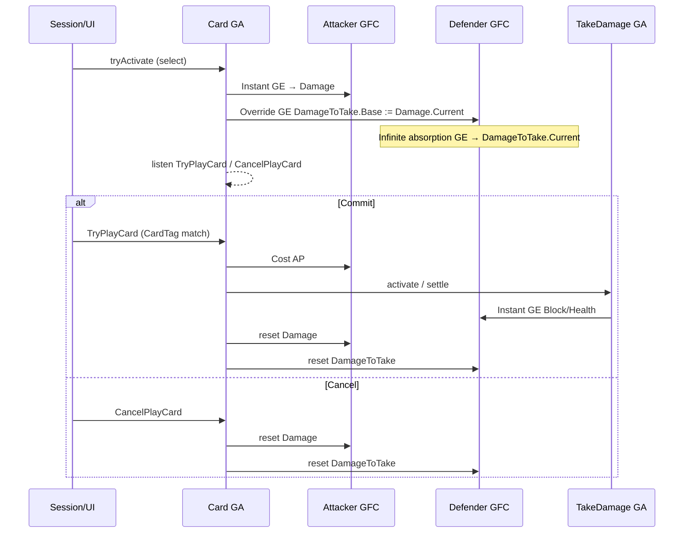

# COMBAT-F02 — GFC-language combat (preview → commit) + CORE gaps

Status: Done  
Feature ID: COMBAT-F02  
Updated: 2026-07-14

Gameplay reference (read-only authority): [combat.md](../../design/systems/combat.md) §出牌、预计算与结算; [attributes.md](../../design/systems/attributes.md); [gameplay-framework.md](../../design/systems/gameplay-framework.md)

Depends on: CORE-F08 (GA), CORE-F09 (pipeline / AttributeBased), COMBAT-F01 (session / deck / turn scaffold)

Supersedes (numerics only): COMBAT-F01 `activateCardAction` + `applyDamage` as the source of truth for combat math

---

## Goal

Replace COMBAT-F01’s **function-first** damage/block shortcuts with **GFC language** (Attribute + GE + EvaluationPipeline + GA + intent events), so that:

1. Selecting a card (+ target) **precomputes** readable meta attributes (`Damage`, `DamageToTake`, later `BlockToGain`).
2. Committing play is an **external intent** (`TryPlayCard`), not decided inside the card GA.
3. Cancelling selection emits `CancelPlayCard` (or equivalent) → card GA ends → **reset meta only**.
4. Absorption is **two layers**: compute `DamageToTake` (no Block) then `TakeDamage` GA settles Block → Health via Instant GE.

COMBAT-F01 remains useful as **turn / deck / AP / win-lose scaffolding**; F02 rewires the **numeric path** and proves the framework on Strike / Defend / Bash (and enemy attack via the same absorption path).

---

## Why two tracks

CORE-F08 / F09 shipped foundation APIs, but they were not stress-tested against this combat business flow. F02 therefore **layers**:

| Track | Name | Purpose |
|-------|------|---------|
| **A** | **CORE combat-enabling gaps** | Extend / correct GFC·GA so preview-wait-commit is expressible |
| **B** | **Combat GFC loop** | Bootstrap attributes/pipelines/GEs/GAs; retire `applyDamage` for dealt damage; validate with few cards |

Track A is **framework debt discovered by B**, not a separate product feature. Prefer thin CORE slices that unblock B probes; avoid speculative GAS completeness.

---

## Product stance (aligned with combat.md)

| Topic | Decision |
|-------|----------|
| F01 combat | Test model: session orchestration OK; **numerics not authoritative** |
| Meta attributes | Normal attributes (`Damage`, `DamageToTake`, …); temporary by **preview lifecycle**, not a framework type |
| `DamageToTake` | “How much damage will be absorbed” **before Block**; not HP loss preview |
| Preview → Commit | Compute early; commit only settles + costs AP |
| Card GA | Expresses **effects + preview + wait**; does **not** own “play card” |
| Play / Cancel | Combat/session (or UI) dispatches **`TryPlayCard` / `CancelPlayCard`** with `CardTag` |
| Events vs aggregators | Events = **intent**; numeric CurrentValues = **GE + pipeline**, not “trigger calculate” events |
| Outgoing Damage | `Damage` Base starts 0; card Instant Add/Override face number → pipeline yields Current |
| Incoming feed | Apply to target: `DamageToTake.Base := src.Damage.Current` (Override GE) → target Infinite absorption GE aggregates |
| TakeDamage | GA samples Block + `DamageToTake`; Instant GEs adjust Block / Health |
| Enemy attack | Same absorption stack (preview optional for P0 NPC); must not call F01 `applyDamage` after cutover |

---

## Track A — CORE gaps (expected)

Invent only what B needs. Register child work as **CORE-F10+** if a gap is large; otherwise land as **COMBAT-F02-A** slices under this doc with code in `packages/core` GA/GFC.

### GA model correction (UE-aligned)

F08’s `kind: 'active' | 'passive'` split is a **MVP convenience**, not the long-term model.

| Correction | Meaning |
|------------|---------|
| **Listening is universal** | Opening event listeners is a natural capability of an **Active** ability instance — not a privilege of “passive GA”. |
| **“Passive” ≈ Give then Activate** | What we called passive is typically: after `grant`, **immediately Activate**, then listen while Active. Same species as an “active” card GA that Activates on select and listens for `TryPlayCard`. |
| **Grant ≠ Activate** | Still holds. The difference is **when** Activate runs, not whether the ability may subscribe to events. |

Track A should converge on: **Activate → optional listen → End unsubscribes**, with `autoActivateOnGrant` (name TBD) as a grant-time policy. Do not build a second event subsystem that only “passives” can use.

### A1 — Active GA that does not auto-end after Instant preview GEs

Today `shouldAutoEnd` ends when all `effectsOnActivate` are Instant. Card GA must **stay Active** after preview to listen for commit/cancel.

**Need:** definition flag or lifecycle policy: `endPolicy: 'manual' | 'auto'` (name TBD).

### A2 — Listen while ability instance is Active

Today F08 only subscribes at **grant** for `kind === 'passive'`. Unify: **any Active instance** may register listeners (channel + event tags + optional payload match); unsubscribe on `endAbility`.

Card GA uses this for `TryPlayCard` / `CancelPlayCard`. Grant-time auto-Activate + listen recreates today’s “passive” path.

### A3 — Payload-aware activation / commit path

Match `payload.cardTag` (or `CardTag`) to the granted card’s identity tag. Cost AP on **commit**, not on preview activate (combat.md).

**Need:** either commit handler inside active GA, or session calls `commit` / `tryActivate` twice with distinct phases — prefer **event-driven commit** per design doc.

### A4 — Reset helpers (application or thin core)

Reset `Damage` / `DamageToTake` bases (Override Instant 0 or remove preview GEs). Prefer **explicit preview GE ids** removable on cancel so Infinite absorption GEs stay.

### A5 — Conditional Instant GE batch for Block settle (P0 pragmatism)

TakeDamage needs branch: Block ≥ Take vs overflow to Health. Options:

| Option | Notes |
|--------|-------|
| **P0** | Tiny `TakeDamage` executor in combat package that **only** emits Instant GEs (no direct `setAttributeBase` for Health/Block) |
| Later | Data-driven conditional effects in CORE |

**P0 recommendation:** combat-local TakeDamage body that still **mutates only via GE**.

### A6 — Cross-entity dependent recompute (if needed)

Preview: attacker Damage changes then target `DamageToTake` feed GE AttributeBased. Prefer **re-apply Override feed GE** each preview refresh (session owns). Optional CORE: notify dependents across entities — defer unless painful.

### Out of Track A (defer)

- Full Ongoing Tag Requirements on GE  
- Custom CalculationClass magnitudes  
- Rich multi-target card UX  
- Armor curve / penetration tuning tables (keep structural hooks only)

---

## Track B — Combat GFC loop

### B1 — Bootstrap character combat set

On `CombatSession` setup, for player and enemy:

- Attributes: `Health`, `Block`, `ActionPoints`, `Damage`, `DamageToTake` (optional P0: multiplier/correction/offset = identity)
- Bind `Damage` pipeline (outgoing stages as needed; can start minimal)
- Bind `DamageToTake` pipeline (absorption stages)
- Apply Infinite GE(s) for “compute DamageToTake” aggregation
- Grant **TakeDamage** ability (active, event-driven or session-invoked on commit)
- Grant card GAs when cards enter hand (or grant catalog + enable by instance tag) — P0 may grant on draw / keep mapping `instanceId → handle`

### B2 — Intent events (native tags)

Propose tags (exact names open to tweak):

| Tag | Meaning |
|-----|---------|
| `GameplayEvent.Combat.TryPlayCard` | Commit intent; payload includes `cardTag` / instance id, target id |
| `GameplayEvent.Combat.CancelPlayCard` | Cancel preview; payload includes `cardTag` / instance id |

Session / CLI emits these; card GA listens while Active.

### B3 — Card flows (validate framework)

| Card | Preview | Commit |
|------|---------|--------|
| **Strike / Bash** | Instant face → `Damage`; Override feed → target `DamageToTake` | Cost AP; target TakeDamage; reset meta; discard |
| **Defend** | Instant or preview meta `BlockToGain` (or show Block delta without mutating until commit) | Cost AP; Instant GE add Block; reset preview meta |

Enemy turn: set `DamageToTake` on player (from intent amount) → TakeDamage → reset. No F01 `applyDamage`.

### B4 — Retire F01 numeric shortcuts

| Remove / stop using as authority | Replacement |
|----------------------------------|-------------|
| `applyDamage` for dealt damage | TakeDamage + GE |
| `activateCardAction` damage branch | Card GA preview + TryPlayCard |
| Defend-only special case via ad-hoc path | Same GA pattern as attacks |

Keep deck, phase, legalActions scaffolding; AP cost moves to **commit**.

### B5 — Full CLI preview experience (满血版 goal)

Players must **feel** the combat.md select→preview→commit loop in the terminal host, not only have it in core APIs:

1. **Selecting a hand card** (←/→ / 1–9) and **selecting a target** (↑/↓) calls `beginCardPreview` immediately.
2. UI reads **GFC meta only** (no second formula): show `Damage` / `DamageToTake` on attack previews, `BlockToGain` on Defend.
3. **Cancel** (Esc when no overlay, or `x`) calls `cancelCardPreview` — HP/Block unchanged, meta cleared.
4. **Space / Enter** commits via `TryPlayCard` (existing session path).
5. Switching card or enemy **re-runs** preview (previous preview cleared first).

This is an **exit criterion** for COMBAT-F02, not a follow-up nice-to-have.

---

## Lifecycle (canonical)

```text
Select card (+ target if needed)
  → end any previous Active card GA (Cancel path / endAbility)
  → tryActivate(card GA)  // no AP yet
  → preview GEs → Damage / DamageToTake readable
  → GA stays Active, listens

TryPlayCard (matching CardTag)
  → pay AP (GE or set via Instant GE)
  → invoke TakeDamage on target (or self for non-damage cards’ settle)
  → discard / combat bookkeeping
  → endAbility → reset meta

CancelPlayCard / switch card / EndTurn
  → endAbility → reset meta only
```



---

## Implementation slices

| Slice | Track | Deliverable |
|-------|-------|-------------|
| **COMBAT-F02-A01** | A | Manual-end / stay-Active GA policy; listening API on Active instance (UE-aligned, not passive-only) |
| **COMBAT-F02-A02** | A | `autoActivateOnGrant` (or keep temporary `kind: passive` shim) rebuilt on Activate-listen; payload match helpers |
| **COMBAT-F02-B01** | B | Bootstrap attrs, pipelines, Infinite absorption GE, TakeDamage |
| **COMBAT-F02-B02** | B | Strike preview + TryPlayCard/CancelPlayCard + reset |
| **COMBAT-F02-B03** | B | Bash + Defend + enemy turn on same stack |
| **COMBAT-F02-B05** | B | CLI full preview UX: select→show meta→cancel/commit |

Do not start Track B cards until A01–A02 (or agreed P0 workaround) are landed.

---

## Test plan

1. Select Strike on enemy → `Damage` / `DamageToTake` match expected face×pipeline (P0 face only).
2. Cancel → meta back to 0; Health/Block unchanged.
3. Commit → Block then Health match old F01 for same face+block cases; meta cleared.
4. Switch card mid-preview → previous meta cleared; new preview applied.
5. Defend commit adds Block via GE only.
6. Enemy attack uses TakeDamage path; no `applyDamage`.
7. `npm run verify` green; F01 turn/deck regressions covered.

---

## Exit criteria

- [x] Card play numeric path uses GFC (GE/GA/pipeline); F01 functions not authorities
- [x] Preview / Cancel / Commit lifecycle matches combat.md (core session API)
- [x] `DamageToTake` excludes Block; TakeDamage settles Block
- [x] Track A gaps: stay-Active + listen-on-Activate landed
- [x] Strike / Defend / Bash + Slime attack validated in tests
- [x] **CLI 满血预览:** select card/enemy shows GFC meta; cancel clears; commit plays
- [x] Design docs: this file Done; Progress log updated

---

## Open questions — resolved defaults (2026-07-14)

| Q | Decision |
|---|----------|
| Q1 Card identity | Payload carries `cardInstanceId` + `actionId`; Active preview binds `instanceId` |
| Q2 Who dispatches TryPlayCard | `CombatSession` (CLI/AI call session API) |
| Q3 TakeDamage | Session/commit invokes `settleTakeDamage` (Instant GE only); dedicated TakeDamage GA can wrap later |
| Q4 Defend preview | `BlockToGain` meta |

## Approval

**Done 2026-07-14** — Track A + Track B + CLI full preview UX; `npm run verify` 113 tests green. Pending user playtest / commit.
