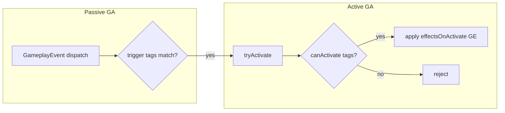

# CORE-F08 — GameplayAbility framework on GFC

Status: Done  
Feature ID: CORE-F08  
Updated: 2026-07-13

Gameplay reference (read-only): [gameplay-framework.md](../../design/systems/gameplay-framework.md) §GameplayAbility, [effects.md](../../design/systems/effects.md)

Depends on: CORE-F05 (GFC), CORE-F06 (Attribute/GE), CORE-F07 (Duration), CORE-F03 (Events)

Blocks: CORE-F09 (numeric pipeline), COMBAT-F02 (combat integration)

---

## Goal

Replace the GFC `grantAbility` stub with a **real, testable GameplayAbility (GA) layer** on `GameplayFrameworkComponent`.

Prove that:

1. **Active abilities** can be granted, checked, activated, and revoked with tag-gated conditions.
2. **Passive abilities** can subscribe to `GameplayEvent` traffic and auto-activate (or attempt activation) when trigger tags match.
3. Activation can **apply GE** to owner and/or target — the same path cards, passives, and future `DealDamage`-style reactions will use.

This feature is **core GFC mechanics only**. Numeric damage pipelines, six-dimension RPG stats, and combat wiring are **CORE-F09** and **COMBAT-F02**.

---

## Product stance (user-aligned)

| Topic | Decision for this feature |
|-------|---------------------------|
| Damage semantics | Attacker computes outgoing damage → dispatches a **damage event** → target's **DealDamage GA** absorbs/applies it. **Mechanism in F08; concrete DealDamage spec in COMBAT-F02.** |
| Derived HP from Constitution | **Out of F08.** Validated in CORE-F09 via Infinite GE on a base attribute. |
| Feature split | **CORE-F08** GA → **CORE-F09** numeric pipeline → **COMBAT-F02** apply to combat |
| Game design fidelity | **Not the goal.** Minimal specs to stress-test GFC. |

---

## Scope

### In scope (P0)

1. **Typed GA definition** (`GameplayAbilityDefinition`) — id, tags, activation gates, **cost**, effects, passive trigger.
2. **Grant / revoke** on GFC — durable handles; snapshot-friendly. **Separate from activate / end.**
3. **`canActivate` / `tryActivate`** — tag checks on **owner, source, and target** when context provided.
4. **Cost check** in `canActivate` — spend attribute (e.g. `ActionPoints`) on successful activate; **no cooldown** in F08.
5. **Activation effects** — apply listed Instant (and optionally Infinite) GE to owner and/or target via existing `applyGameplayEffect`.
6. **Passive GA** — event listener on default or explicit channel; on matching event, `tryActivate`.
7. **Granted vs active state** — grant persists until `revoke`; activation creates `ActiveAbility` until `endAbility` (instant may auto-end same tick).
8. **Trace + deterministic tests** — no TTY.

### Out of scope (deferred)

| Topic | Target feature |
|-------|----------------|
| Cooldown (turn/time-based) | Later CORE or COMBAT slice |
| Cancel-with-tags / block-with-tags between concurrent actives | Post-F08 |
| Ongoing GE tag requirements (`Ongoing Tag Requirement`) | CORE-F09 |
| Multi-stage damage pipeline attributes | CORE-F09 |
| Card JSON / data assets | DATA-F01 |
| CombatSession rewiring | COMBAT-F02 |
| `DealDamage` or any game-specific GA defs | **COMBAT-F02** — core stays business-agnostic |

---

## Decision log

| # | Topic | Decision | Rationale |
|---|-------|----------|-----------|
| D1 | Owner | GFC stores **granted** + **active** ability state per entity | Matches ASC; grant ≠ activate |
| D2 | Definition vs instance | **Definition** = immutable spec; **GrantedAbility** = handle + def; **ActiveAbility** = one activation run | Card stays granted; each play is activate |
| D3 | Activation API | `canActivate(handle, ctx)` / `tryActivate(handle, ctx)` / `endAbility(instanceId)` | Revoke is independent of end |
| D4 | Tag gates (P0) | Owner + **source** + **target** gates (required=all, blocked=any) | User: implement src/tgt in F08 |
| D5 | Cost | `cost?: { attribute, amount }` checked in `canActivate`; spent on successful `tryActivate` | User: cost yes, cooldown no |
| D6 | Cooldown | **Out of F08** | User decision |
| D7 | Effects on activate | `effectsOnActivate: { target: 'self' \| 'target', effect: GE }[]` | Reuses CORE-F06/F07 |
| D8 | Passive trigger | Subscribe on grant; `channelTag` omitted → **`Channel.Default` only** | User Q3 |
| D9 | Passive activation | Auto `tryActivate` when trigger tags match | Passive GA validation |
| D10 | Grant vs revoke vs activate | **Revoke removes grant/listener only**; does not imply `endAbility`. Instant activate may auto-`endAbility` same tick. | User Q5 |
| D11 | Core purity | No game-specific GA defs (e.g. DealDamage) in `packages/core` | User Q6; COMBAT-F02 owns defs |
| D12 | Duplicate grant | **Each `grantAbility` returns a new handle** (UE `GiveAbility` style). No core-level dedup. | User approved 2026-07-13 |
| D13 | Data source | TS definitions in tests/examples only; production defs live in host/combat packages | Core business-agnostic |

---

## Architecture

```text
RuleEngine
  └── GameplayFrameworkComponent
        ├── grantedAbilities: Map<handle, GrantedAbility>
        ├── activeAbilities: Map<instanceId, ActiveAbility>
        ├── passiveSubscriptions: derived from granted passives
        └── API:
              grantAbility(def) -> handle
              revokeAbility(handle)
              canActivate(handle, ctx) -> boolean
              tryActivate(handle, ctx) -> ActivationResult
              listGrantedAbilities() / listActiveAbilities()
```



### Layer boundaries (three-feature split)

| Layer | Feature | Responsibility |
|-------|---------|----------------|
| GA framework | **CORE-F08** | Grant, activate, passive event reaction, GE on activate |
| Numeric pipeline | **CORE-F09** | Primary attrs, derived HP (Constitution → Health), damage stage attributes, attacker-side evaluation |
| Combat integration | **COMBAT-F02** | Card = GA, attack dispatches damage event, target `DealDamage` passive GA, replace COMBAT-F01 shortcuts |

---

## Data model (proposed)

```typescript
type GameplayAbilityKind = 'active' | 'passive';

type GameplayAbilityTagGates = {
  /** Owner (ability holder) must have ALL. */
  activationRequiredTags?: string[];
  /** Owner must have NONE (any blocks). */
  activationBlockedTags?: string[];
  /** Source entity must have ALL (when ctx.sourceEntityId set). */
  sourceRequiredTags?: string[];
  /** Source must have NONE (any blocks). */
  sourceBlockedTags?: string[];
  /** Target entity must have ALL (when ctx.targetEntityId set). */
  targetRequiredTags?: string[];
  /** Target must have NONE (any blocks). */
  targetBlockedTags?: string[];
  /** Ability identity / descriptor tags. */
  abilityTags?: string[];
};

type GameplayAbilityCost = {
  attribute: string;
  amount: number;
};

type GameplayAbilityEffectTarget = 'self' | 'target';

type GameplayAbilityEffectBinding = {
  target: GameplayAbilityEffectTarget;
  effect: GameplayEffectDefinition;
};

type GameplayAbilityPassiveTrigger = {
  /** Default: `Channel.Default` (`DEFAULT_CHANNEL_TAG`). */
  channelTag?: string;
  eventTags: string[];
  match?: 'all' | 'any';
};

type GameplayAbilityDefinition = {
  id: string;
  kind: GameplayAbilityKind;
  name?: string;
  tags: GameplayAbilityTagGates;
  cost?: GameplayAbilityCost;
  effectsOnActivate: GameplayAbilityEffectBinding[];
  passiveTrigger?: GameplayAbilityPassiveTrigger;
  stacking?: 'single' | 'multiple'; // reserved; grants always create new handles (D12)
};

type AbilityActivationContext = {
  instigatorEntityId: EntityId;
  sourceEntityId?: EntityId;
  targetEntityId?: EntityId;
  event?: GameplayEvent;
  payload?: Record<string, unknown>;
};

type ActivationResult =
  | { ok: true; instanceId: string }
  | { ok: false; reason: 'not_granted' | 'cannot_activate' | 'missing_target' | 'missing_source' | 'insufficient_cost' };
```

### State model (grant ≠ activate)

| State | Meaning | Ends when |
|-------|---------|-----------|
| **Granted** | Entity *has* the ability (card in deck/hand grant, passive equipped) | `revokeAbility(handle)` |
| **Active** | Ability *is running* this activation | `endAbility(instanceId)` (instant: auto-end after effects same tick) |

- `revokeAbility` removes grant + passive listener; **does not** call `endAbility` on in-flight actives (orthogonal lifecycles).
- A card GA: granted for the battle; each play = `tryActivate` on same handle; grant remains after play.

---

## Activation flow

### Active ability (e.g. future card play)

1. Combat/host calls `tryActivate(grantedHandle, ctx)` with `instigator` = player, `target` = enemy.
2. `canActivate`:
   - handle exists (granted, not revoked)
   - owner / source / target tag gates pass (resolve GFC tags on respective entities)
   - `cost` affordable if defined
   - target/source present when gates or bindings require them
3. On success:
   - create `ActiveAbility` instance
   - spend `cost` if defined
   - apply `effectsOnActivate` GE bindings
   - if all effects are Instant-only, `endAbility(instanceId)` same tick
4. Return `ActivationResult`

### Passive ability (e.g. future DealDamage in COMBAT-F02)

1. On `grantAbility` with `kind === 'passive'`, subscribe on **`passiveTrigger.channelTag ?? Channel.Default`**.
2. On matching event → build `ctx` from event → `tryActivate` if `canActivate`.
3. Concrete DealDamage def and payload: **COMBAT-F02 only** (not in core).

---

## GFC API changes (target)

Replace stub:

```typescript
grantAbility(_spec: unknown): string;
revokeAbility(handle: string): void;
```

With:

```typescript
grantAbility(def: GameplayAbilityDefinition): string;
revokeAbility(handle: string): boolean;
canActivate(handle: string, ctx: AbilityActivationContext): boolean;
tryActivate(handle: string, ctx: AbilityActivationContext): ActivationResult;
endAbility(instanceId: string): boolean;
listGrantedAbilities(): GrantedAbilitySnapshot[];
listActiveAbilities(): ActiveAbilitySnapshot[];
```

Passive listeners are **internal** — no separate public subscribe API in P0.

---

## Trace additions (proposed)

| kind | payload |
|------|---------|
| `ga.grant` | `entity`, `abilityDefId`, `handle`, `kind` |
| `ga.revoke` | `entity`, `handle`, `abilityDefId` |
| `ga.activate.attempt` | `entity`, `handle`, `abilityDefId`, `ok`, `reason?` |
| `ga.activate` | `entity`, `instanceId`, `abilityDefId`, `sourceId?`, `targetId?` |
| `ga.passive.trigger` | `entity`, `handle`, `eventTags[]` |

---

## Implementation slices

| Slice | Deliverable |
|-------|-------------|
| **CORE-F08-S01** | Types, `grantAbility` / `revokeAbility`, granted storage, snapshots, tests |
| **CORE-F08-S02** | `canActivate`: owner + source + target tag gates + cost check |
| **CORE-F08-S03** | `tryActivate` / `endAbility` + cost spend + GE application + trace |
| **CORE-F08-S04** | Passive trigger registration + event dispatch → `tryActivate` |
| **CORE-F08-S05** | Integration probes: grant passive → dispatch event → GE applied |

Do not start code until this doc is approved.

---

## Test plan (core)

1. Grant active ability → handle returned; snapshot lists it.
2. Revoke → handle gone; passive listener removed.
3. `canActivate` fails when blocked tag present on owner.
4. `tryActivate` applies Instant GE to self (attribute changes).
5. `tryActivate` with `target` binding applies GE to target entity.
6. Passive: grant + dispatch matching event → effects run; non-matching event → no effect.
7. Duplicate grant of `stacking: 'single'` def → second grant rejected or replaces (per approved D8).
8. Trace entries emitted for grant/activate/passive trigger.

---

## Exit criteria

- [x] GFC exposes typed GA grant/activate/revoke API (no `unknown` stub)
- [x] Active + passive paths share `canActivate` / `tryActivate`
- [x] Activation applies GE through existing GFC GE path
- [x] Passive GA reacts to tagged `GameplayEvent` without ad-hoc callbacks on entity
- [x] `npm run verify` green with new GA tests
- [x] No combat rewiring in this feature (COMBAT-F01 remains until COMBAT-F02)

---

## Downstream features (registered, spec later)

### CORE-F09 — Numeric calculation pipeline

- Six primary attributes (minimal); **HP derived from Constitution** via Infinite GE (formula arbitrary; validation-focused).
- Attacker-side damage stage attributes per gameplay-framework.md / effects.md (P0 subset).
- Ongoing GE validation hooks if needed.

### COMBAT-F02 — GFC-backed combat integration

- Replace `CardAction` with granted/active card GA.
- Attacker computes damage (F09 pipeline) → dispatch `GameplayEvent.Combat.*.DealDamage` (exact tag TBD).
- Target grants **DealDamage passive GA**; on event where `target === self`, activate and absorb (block/HP).
- `CombatSession` orchestrates; no direct `combat-damage.ts` attribute writes.

---

## Resolved decisions (user 2026-07-13)

| Q | Decision |
|---|----------|
| Q1 | **Cost yes** (`attribute` + `amount`); **cooldown no** in F08 |
| Q2 | **Owner + source + target** tag gates in P0 |
| Q3 | Passive omitting `channelTag` → listen on **`Channel.Default`** only |
| Q4 | **Multiple grants** — each call new handle (align UE GAS); no core dedup |
| Q5 | **Grant and activate are separate**; `revoke` ≠ `endAbility` |
| Q6 | **No game-specific GA in core**; DealDamage etc. in COMBAT/host packages |

---

## Approval

**Approved 2026-07-13.** Implementation in progress at **CORE-F08-S01**.
