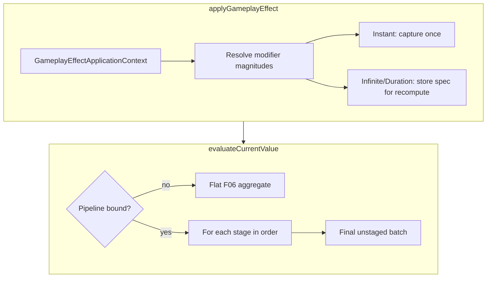

# CORE-F09 — Staged GE evaluation & Attribute Based magnitudes

Status: Done  
Feature ID: CORE-F09  
Updated: 2026-07-13

Gameplay reference (read-only): [gameplay-framework.md](../../design/systems/gameplay-framework.md) §AttributeEvaluationPipeline, §Open questions A/B; [attributes.md](../../design/systems/attributes.md); [effects.md](../../design/systems/effects.md)

Depends on: CORE-F06 (Attribute/GE), CORE-F07 (Duration), CORE-F08 (GA — optional consumer of GE ctx)

Blocks: COMBAT-F02 (GFC-backed combat integration)

---

## Goal

Extend `@cardgame/core` **GameplayEffect / GFC attribute recompute** into a **general numeric evaluation framework** aligned with the gameplay design doc:

1. **Attribute Based modifier magnitudes** (UE GAS-style capture from Source/Target attributes).
2. **`GameplayEffectApplicationContext`** on `applyGameplayEffect` (independent of GA activation context).
3. **Modifier Evaluation Stage** (`GameplayTag`) + **AttributeEvaluationPipeline** (ordered stage list, bound per Character per Attribute).
4. **Staged aggregation** inside each stage, **sequential** application across stages; unstaged modifiers run in a **final** batch.

This feature validates the **GE calculation pipeline**. It is **not** a dedicated combat/damage module and does **not** introduce `evaluateOutgoingDamage()` or framework-level “meta attributes”.

---

## Product stance (user-aligned)

| Topic | CORE-F09 decision |
|-------|-------------------|
| What we build | **Generic GE evaluation machinery** in `packages/core` |
| Damage | Application convention: `Damage` is a normal Attribute using a bound pipeline (e.g. `DamageEvaluationPipeline`); “meta” is **not** a framework type |
| Cards | Apply GE with modifiers on pipeline stages; **no** card-specific math in core |
| `evaluateOutgoingDamage()` | **Rejected** — read `Damage.currentValue` (or apply instant GE) after recompute |
| Attribute Based capture | **Instant:** once at apply; **Infinite/Duration:** re-capture on every recompute |
| GE context | Separate from GA ctx; **required for Attribute Based**; Scalable-only may default `instigator` = GFC owner |
| Multiply in stage | **Product (`*=`)** among Multiply modifier magnitudes (user correction; design pseudocode staged-loop had typo) |
| Unstaged modifiers | **Final batch** after all pipeline stages (design Open Q A3; unstaged-loop condition corrected) |
| Armor / penetration timing | **No special API** — Source attributes participate in Target attribute pipeline via GE (design Open Q B2) |
| Extra damage wording | Application semantics only (design Open Q B3); not framework branches |

---

## Design authority map

| Design source | Impl doc usage |
|---------------|----------------|
| `gameplay-framework.md` §AttributeEvaluationPipeline | Pipeline = stage **order declaration**; framework provides staged recompute |
| `gameplay-framework.md` GE examples (`GE_CommonDamageCalculation`, `DamageEvaluationPipeline`) | **Validation fixtures** in tests; not shipped combat defs in core |
| Open Q **A1** | Multiply: implement **`*=` product** within a stage |
| Open Q **A2** | Override: **always overrides** stage outcome (implementation may apply last-wins or short-circuit; behavior must match) |
| Open Q **A3** | Modifiers **without** stage: **final** aggregation pass |
| Open Q **B2** | Penetration as Source-side attribute in Target pipeline — COMBAT-F02 configures GE |
| Open Q **B3** | “+n to this hit” vs “another damage instance” — application/event policy in COMBAT-F02 |

---

## Scope

### In scope (P0)

1. **`GameplayEffectApplicationContext`** passed to `applyGameplayEffect(effect, ctx?)`.
2. **Modifier magnitude kinds:** `Scalable` (constant) and `AttributeBased` (capture from ctx Source/Target).
3. **Modifier `evaluationStage?: GameplayTag`** on each modifier.
4. **`AttributeEvaluationPipeline` binding** on GFC: per **entity**, per **attribute name**, ordered stage tags.
5. **Staged `evaluateCurrentValue`** when a pipeline is bound; **legacy flat aggregate** when no pipeline (CORE-F06 behavior).
6. **Capture timing** rules (Instant vs ongoing GE).
7. **Trace** for pipeline stages, captures, and recompute (proposed kinds below).
8. **Deterministic tests** without combat session.

### Out of scope (deferred)

| Topic | Target |
|-------|--------|
| `Custom CalculationClass` magnitudes | CORE-F09+ or COMBAT slice |
| `SetByCaller` magnitudes | Later |
| Ongoing Tag Requirements on GE | CORE-F09+ (design describes; not required for pipeline proof) |
| Divide op in P0 staged loop | Optional if already in F06; stage math uses if present |
| Full six primary attributes | Application; F09 probe uses `Constitution` → `Health` only |
| Combat events, DealDamage GA, card defs | COMBAT-F02 |
| Meta attribute flag / storage semantics | Application only |
| `docs/design/systems/*.md` edits | User-owned |

---

## Architecture

```text
RuleEngine
  └── GameplayFrameworkComponent
        ├── attributes: base + current
        ├── activeEffects → modifiers (with stage + magnitude spec)
        ├── evaluationPipelines: Map<attribute, ordered stage tags>
        └── applyGameplayEffect(def, ctx?)
              ├── resolve magnitudes (Scalable | AttributeBased + timing)
              ├── apply Instant to base OR register Infinite/Duration
              └── recomputeAttributes → evaluateCurrentValue(attr)
                    ├── no pipeline → flat (F06): (base+ΣAdd)*ΠMultiply
                    └── pipeline    → staged algorithm (below)
```



### Layer boundaries

| Layer | Responsibility |
|-------|----------------|
| **CORE-F09 (framework)** | Context, magnitude resolution, stage tags, pipeline binding, staged recompute |
| **Application (combat/cards/characters)** | Which attributes exist, pipeline definitions, Damage as settlement attribute, events |
| **COMBAT-F02** | Wire card GA → GE ctx → read Damage → dispatch damage event → target DealDamage passive |

---

## Decision log

| # | Topic | Decision | Rationale |
|---|-------|----------|-----------|
| D1 | Pipeline data shape | Ordered `GameplayTag[]` only — **declaration of stage order** | Design doc §425–426 |
| D2 | Pipeline scope | Bound per **GFC** per **attribute key** | Per-character pipelines |
| D3 | No pipeline | Ignore `evaluationStage`; use **CORE-F06 flat** formula | Design §350 |
| D4 | Stage identifier | `GameplayTag` (not enum) | Design §425 |
| D5 | Multiply in stage | **Product** of resolved magnitudes (`*=`), identity **1** | User correction; Open Q A1 |
| D6 | Add in stage | **Sum** of resolved magnitudes (`+=`), identity **0** | Consistent aggregation |
| D7 | Divide in stage | **Product** on divisor magnitudes (`*=`), identity **1** | Align with design pseudocode |
| D8 | Override in stage | If any Override in stage, **Override wins** (last applied wins within stage if multiple) | Open Q A2 |
| D9 | Stage combine | `current = (current + addSum) * multiplyProduct / divideProduct`, then apply override if set | Design staged loop intent |
| D10 | Unstaged pass | After all ordered stages, one final pass with **same** op rules | Open Q A3 |
| D11 | Attribute Based timing | Instant: capture at apply; Infinite/Duration: **re-capture each recompute** | User verbal |
| D12 | GE ctx vs GA ctx | Separate types; GA builds GE ctx when applying effects | User verbal; GE is GFC capability |
| D13 | Meta attribute | **Not** in framework | User verbal |
| D14 | Damage helper API | **None** in core | User verbal |
| D16 | Missing Source/Target for Attribute Based | **Throw `GameplayEffectError`** | User Q1 — application error |
| D17 | Unknown stage vs pipeline | **Unstaged final batch + trace warning** | User Q2 — mistake not error |
| D19 | Source attribute change | Recompute **dependent** attributes on same GFC when a captured backing attribute changes | Probe 6 — same-entity invalidation |

---

## Data model (proposed)

### GameplayEffectApplicationContext

```typescript
type GameplayEffectApplicationContext = {
  instigatorEntityId: EntityId;
  sourceEntityId?: EntityId;
  targetEntityId?: EntityId;
  payload?: Record<string, unknown>;
};
```

- Used for **Attribute Based** capture and future SetByCaller.
- `applyGameplayEffect(effect)` may default `instigator` = GFC owner, empty source/target (Scalable-only effects still work).
- GA `tryActivate` **constructs** GE ctx from activation ctx when applying `effectsOnActivate`.

### Modifier magnitude

```typescript
type GameplayModifierMagnitude =
  | { kind: 'Scalable'; value: number }
  | {
      kind: 'AttributeBased';
      captureFrom: 'Source' | 'Target';
      attribute: string;
      valueKind: 'Base' | 'Current';
      coefficient?: number; // default 1
    };
```

- Resolved to a **number** before op aggregation.
- Missing capture entity or attribute → treat as **0** (or fail apply — **see Open Q1**).

### GameplayEffectModifier (extended)

```typescript
type GameplayEffectModifier = {
  attribute: string;
  op: 'Add' | 'Multiply' | 'Override'; // Divide optional if retained from F06
  magnitude: GameplayModifierMagnitude;
  evaluationStage?: GameplayTag; // omit → final unstaged batch (when pipeline bound)
};
```

### AttributeEvaluationPipeline

```typescript
type AttributeEvaluationPipeline = {
  attribute: string;
  stageOrder: readonly GameplayTag[]; // e.g. CommonDamage, DamageOffset
};
```

- Stored on GFC: `bindEvaluationPipeline(pipeline)` / `getEvaluationPipeline(attribute)`.
- **Not global** — two entities can bind different stage orders for `Damage`.

---

## Evaluation algorithm (canonical — supersedes design doc staged-loop typos)

Given attribute `A`, base value `B`, active modifiers `M`, optional pipeline `P`.

### A) No pipeline bound on `A`

Use **CORE-F06** (current):

```text
current = (base + Σ Add) * Π Multiply   // Override: last-wins among active (F06)
```

Modifiers' `evaluationStage` tags are **ignored**.

### B) Pipeline bound: `P.stageOrder = [S1, S2, …, Sn]`

```text
value := base

for each stage S in P.stageOrder:
  addSum := 0
  multiplyProduct := 1
  divideProduct := 1
  overrideValue := undefined

  for each modifier m targeting A where m.stage == S:
    mag := resolveMagnitude(m, ctx, timingRules)
    switch m.op:
      Add:       addSum += mag
      Multiply:  multiplyProduct *= mag
      Divide:    divideProduct *= mag
      Override:  overrideValue := mag   // last wins in stable order

  if overrideValue !== undefined:
    value := overrideValue
  else:
    value := (value + addSum) * multiplyProduct / divideProduct

// Final batch: modifiers targeting A with NO evaluationStage (or stage not in pipeline — see Open Q2)
addSum := 0
multiplyProduct := 1
divideProduct := 1
overrideValue := undefined

for each remaining modifier m targeting A without staged assignment:
  ... same aggregation ...

value := overrideValue ?? (value + addSum) * multiplyProduct / divideProduct

return value
```

**Notes:**

- **PreEvaluate (virtual):** design data-flow treats `BaseValue` as the value **before** the first ordered stage; there is no tag for it.
- **Multiply product:** user-corrected semantics (`*=`), initial identity **1** (design staged-loop init `0` / `+=` are typos).
- Design prose example `CurrentDamage * DamageMultiplier * DamageCorrection` maps to **one stage** (`CommonDamage`) with **two Multiply modifiers** → product of captured values.
- **DamageOffset** as **Add** in a **later stage** matches `GE_DamageOffsetCalculation` example (`CuurentDamage += DamageOffset` in design data-flow).

### Magnitude resolution timing

| GE duration | When `AttributeBased` is resolved |
|-------------|-----------------------------------|
| **Instant** | Once at `applyGameplayEffect`; stored magnitude affects base immediately (F06 instant path) |
| **Infinite** | On **every** `recomputeAttributes` for affected attributes |
| **Duration** | On **every** recompute while active |

`Scalable` is always the constant `value`.

Capture reads `ctx.sourceEntityId` / `ctx.targetEntityId` → resolve GFC → read `Base` or `Current` per spec.

---

## Application patterns (validation, not core business)

### Probe 1 — Derived Health (Constitution → Health)

Application/test fixture:

- Set `Constitution` base on entity.
- Apply **Infinite** GE on `Health`:

```text
Add, evaluationStage: (none or single stage if pipeline bound)
magnitude: AttributeBased(Source, Constitution, Current, coefficient: k)
```

- Optional: bind trivial one-stage pipeline on `Health` to prove stage path.
- Changing `Constitution` base → recompute → `Health.current` updates **without** a separate derivation driver.

Formula arbitrary in tests (e.g. `Health contribution = 10 + Constitution * 2` via coefficient/add GE split).

### Probe 2 — Damage pipeline (design doc example)

**Test-only** pipeline binding on `Damage`:

| Stage order | Example modifiers |
|-------------|-------------------|
| `EvaluationStage.CommonDamage` | Add (custom deferred), Multiply × `DamageMultiplier`, Multiply × `DamageCorrection` |
| `EvaluationStage.DamageOffset` | Add × `DamageOffset` (Attribute Based) |

Card GE (application, later COMBAT-F02) only adds modifiers (e.g. add to `Damage` base or Add modifier in `CommonDamage`).

Settlement: read `Damage.currentValue` after recompute — **not** a core helper.

---

## GFC API changes (target)

```typescript
// Context
applyGameplayEffect(effect: GameplayEffectDefinition, ctx?: GameplayEffectApplicationContext): string;

// Pipeline (per attribute on this entity)
bindEvaluationPipeline(pipeline: AttributeEvaluationPipeline): void;
getEvaluationPipeline(attribute: string): AttributeEvaluationPipeline | undefined;
clearEvaluationPipeline(attribute: string): void;
```

`GameplayEffectModifier.magnitude` becomes `GameplayModifierMagnitude` (breaking type change — update F06 tests).

---

## Trace additions (proposed)

| kind | payload |
|------|---------|
| `ge.ctx` | `entity`, `effectDefId`, `sourceId?`, `targetId?` |
| `ge.magnitude.resolve` | `entity`, `attribute`, `kind`, `captured`, `from?` |
| `attr.pipeline.stage` | `entity`, `attribute`, `stage`, `before`, `after` |
| `attr.pipeline.final` | `entity`, `attribute`, `before`, `after` |

---

## Implementation slices

| Slice | Deliverable |
|-------|-------------|
| **CORE-F09-S01** | `GameplayEffectApplicationContext`; thread through `applyGameplayEffect` + GA effect application |
| **CORE-F09-S02** | `GameplayModifierMagnitude` Scalable + AttributeBased; capture + timing rules |
| **CORE-F09-S03** | `evaluationStage` on modifiers; collect staged vs unstaged |
| **CORE-F09-S04** | `bindEvaluationPipeline` / query API on GFC |
| **CORE-F09-S05** | Staged `evaluateCurrentValue` + unstaged final batch; F06 fallback when no pipeline |
| **CORE-F09-S06** | Probe tests (Constitution→Health; Damage pipeline fixture) + trace |

Do not start code until this doc is approved.

---

## Test plan (core)

1. **No pipeline:** existing F06 aggregate unchanged for legacy attributes.
2. **Scalable + pipeline:** staged Add/Multiply order changes outcome vs flat.
3. **Multiply product:** two Multiply modifiers in same stage → product, not sum.
4. **Unstaged last:** modifier without stage applies after all ordered stages.
5. **Attribute Based Instant:** capture once; Constitution change does not alter instant-applied base.
6. **Attribute Based Infinite:** Constitution change **does** alter `Health.current` after recompute.
7. **GE ctx:** Attribute Based reads Source vs Target per spec; missing entity → agreed failure mode.
8. **Per-entity pipeline:** two GFCs, different stage orders for same attribute name → different results.
9. **GA path:** `tryActivate` applies GE with ctx derived from activation (smoke).
10. **Damage fixture:** design-doc-like `CommonDamage` → `DamageOffset` pipeline reproduces expected numeric flow in isolation.

---

## Exit criteria

- [x] `applyGameplayEffect` accepts GE application context
- [x] Attribute Based magnitudes with Instant vs ongoing capture timing
- [x] Modifiers support `evaluationStage` tags
- [x] Per-GFC per-attribute `AttributeEvaluationPipeline` binding
- [x] Staged recompute matches canonical algorithm (multiply product, unstaged final)
- [x] No `evaluateOutgoingDamage` / meta attribute / combat-specific APIs in core
- [x] `npm run verify` green with new tests
- [x] COMBAT-F01 behavior unchanged until COMBAT-F02

---

## Relationship to COMBAT-F02

```text
Card GA.tryActivate
  → applyGameplayEffect(cardGE, { source: player, target: enemy, ... })
  → attacker GFC recompute (Damage pipeline)
  → application reads Damage.currentValue
  → dispatch GameplayEvent.Combat.*.DealDamage (payload)
  → target DealDamage passive GA (defined in combat package, not core)
```

CORE-F09 enables the **left side** only.

---

## Resolved decisions (2026-07-14)

### Q1 — Missing capture target

**Decision:** Application-layer error — **reject** apply/recompute and throw a clear error (`GameplayEffectError`). No silent `0`, no fallback to self.

### Q2 — Modifier stage not in pipeline order

**Decision:** Treat as **caller mistake**, not hard failure. Modifier **degrades to unstaged final batch**; emit **`ge.modifier.stage.fallback` trace warning** (once per apply when detected).

### Q3 — Ongoing GE application context

**Decision:** **Snapshot `GameplayEffectApplicationContext` on `ActiveGameplayEffect` at apply time.** Source/Target entity ids remain fixed for the effect lifetime. On each recompute, **Attribute Based** reads **current** (or base per spec) attribute values from those entities — no UE Snapshot of attribute values at apply time.

---

## Approval

**Approved 2026-07-14.** Implementation in progress at **CORE-F09-S01**.

